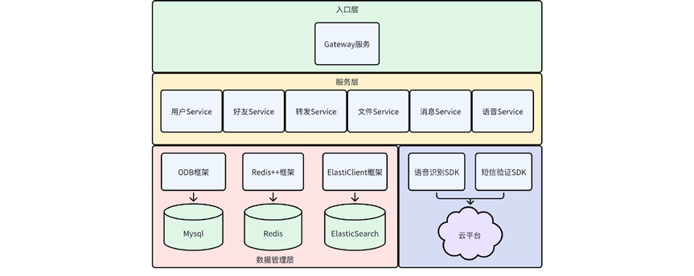

# 项目简介
> 该项目为即时聊天项目的服务端，采用微服务框架设计，将多个服务拆分为多个子业务，由网关服务进行统一服务转发。项目代码使用Nix进行部署。
---
## 技术栈

| 层级   | 组件            | 说明              |
|------|---------------|-----------------|
| RPC  | brpc          | 高性能 C++ RPC 框架  |
| 服务发现 | etcd          | 注册中心 & 配置中心     |
| 缓存   | Redis         | 登陆状态管理          |
| 队列   | RabbitMQ      | 可靠消息投递与异步解耦     |
| 数据库  | MySQL + ODB   | 业务持久化 & ORM     |
| 搜索引擎 | Elasticsearch | 历史消息全文检索        |
| 日志   | spdlog        | 异步、多 sink、运行时热更 |
| 部署   | Nix           | 构建、依赖、运行环境声明式管理 |


### 功能特性
- ✅ 单聊 / 群聊 / 已读回执
- ✅ 好友 / 群组管理
- ✅ 文件/图片/语音消息（对象存储 + CDN）
- ✅ 聊天信息/好友搜索
- ✅ 用户注册、登录、短信验证码
- ✅ 用户个人信息管理
- ✅ 消息漫游 & 全文检索（ES）

---

## 架构图



## 快速开始
```bash
git clone https://github.com/cyclesw/ChatServer --depth 1
cd ChatServer
nix develop --impure

cmake -B build; cmake --build build;
```
## 关联项目
**客户端**: https://github.com/cyclesw/ChatClient